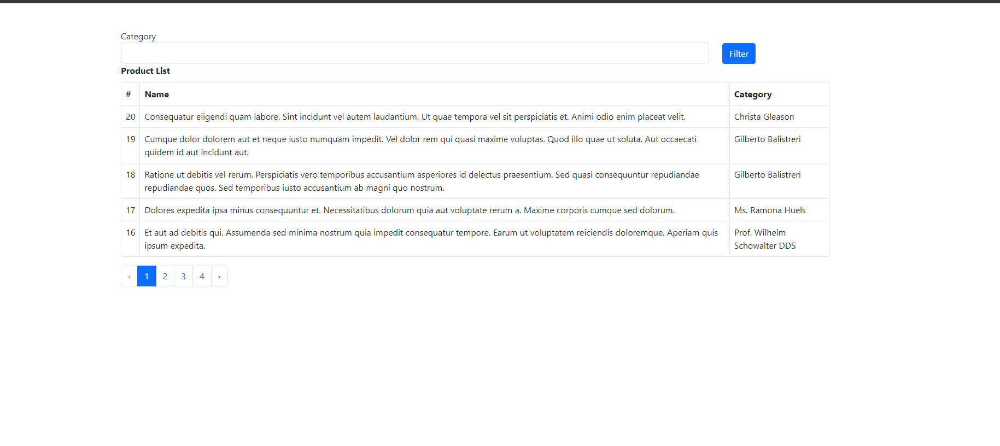
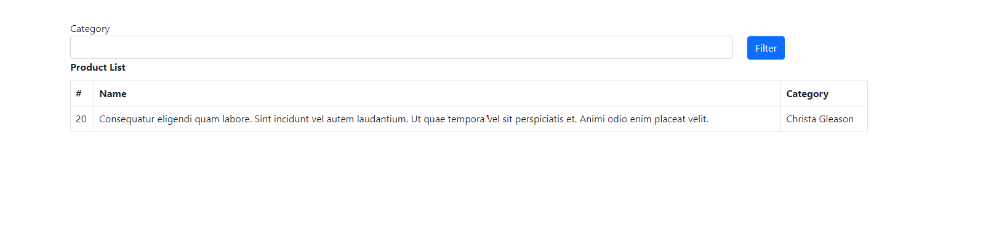

# Gym-Managment-System

## Table of Contents
* [General Info](#general-information)
* [Technologies Used](#technologies-used)
* [Screenshots](#screenshots)
* [Setup](#setup)
* [Usage](#usage)
* [Project Status](#project-status)
* [Contributing](#Contributing)
* [Contact](#contact)
<!-- * [License](#license) -->

## General Information
This simpel example aboute using scout package for search with model 
<!-- You don't have to answer all the questions - just the ones relevant to your project. -->

## Technologies Used
- PHP - version 8.2
- Laravel 10
- package scout
- Bootstrap - version 5.0
- CSS
- Mysql
- HTML5

## Screenshots

<!-- If you have screenshots you'd like to share, include them here. -->

## Setup
1. Clone the repository: `git clone https://github.com/Ahmad-Alqunbar/Scout-Search-Project.git`
2. edit .env file database config .
2. in terminal write php artisan migrate .

## Usage
1. Navigate to the project directory.
2. Start your local development server.
3. Access the system through your web browser.

## Project Status
Project is: _in progress_ .

## Contributing
Contributions are welcome! If you'd like to contribute, please follow these guidelines:
- Fork the repository.
- Create a new branch: `git checkout -b feature-name`
- Make your changes and commit: `git commit -m 'Add feature-name'`
- Push to the branch: `git push origin feature-name`
- Submit a pull request.

## Contact
Created by [Ahmad Alqunbar](https://www.linkedin.com/in/ahmad-alqunbar/) - feel free to contact me at [ahmad.alqunbar97@gmail.com](mailto:ahmad.alqunbar97@gmail.com)!

<!-- Optional -->
<!-- ## License -->
<!-- This project is open source and available under the [... License](). -->
<!-- You don't have to include all sections - just the one's relevant to your project -->
